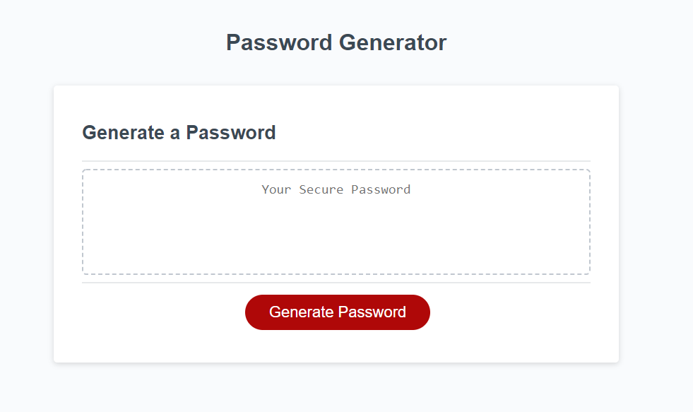
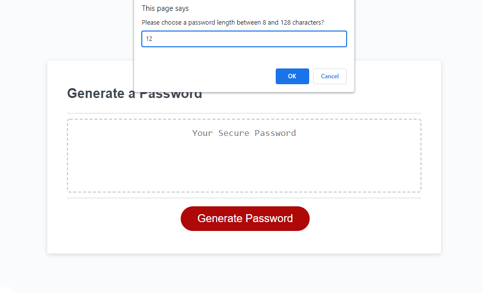
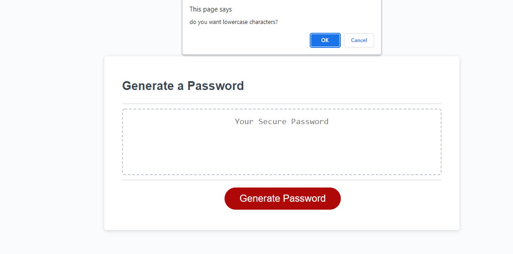
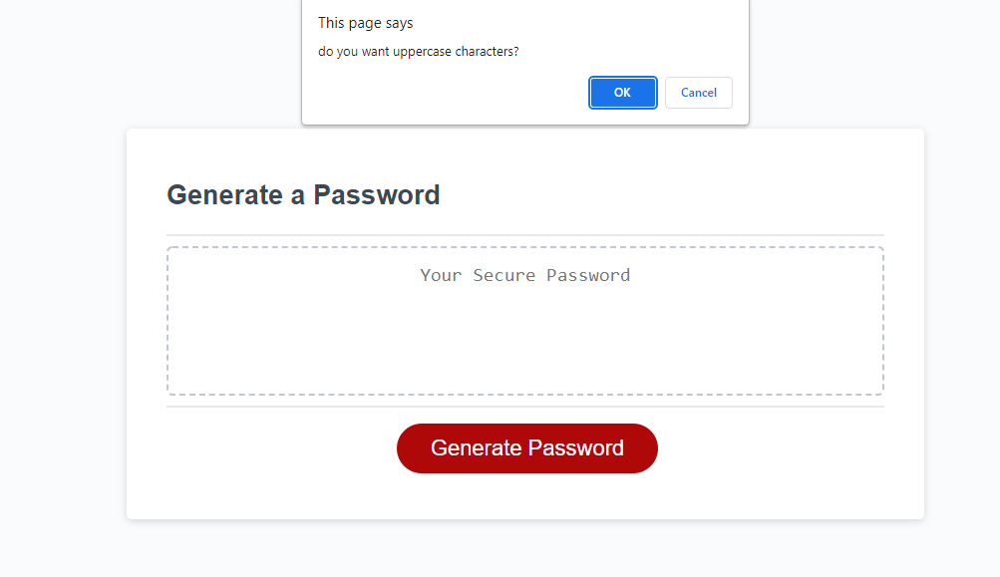
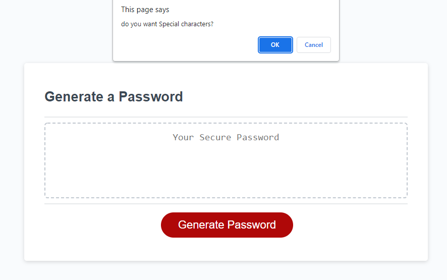
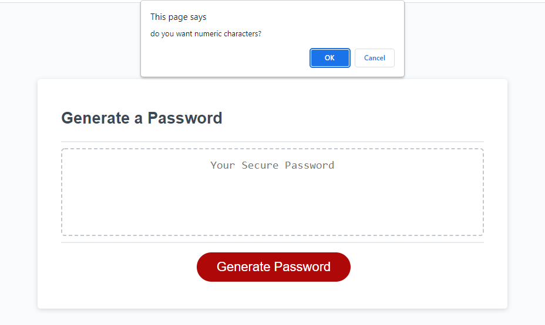
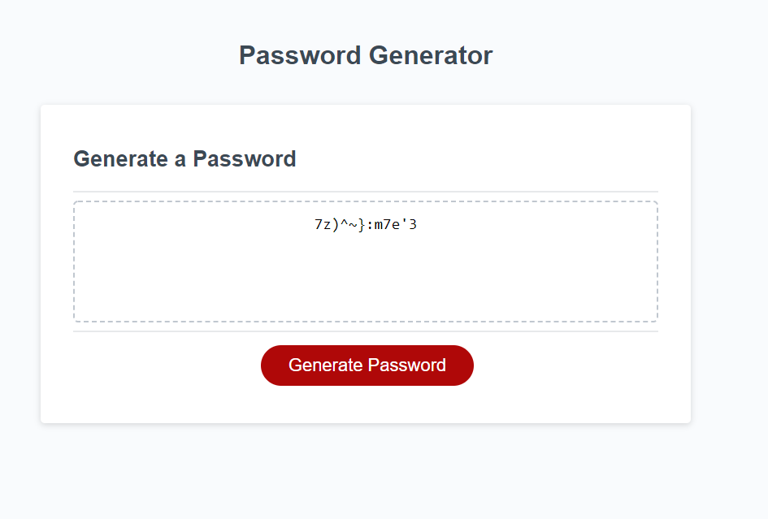

# <MB Password Generator>

## Description

For the latest challenged we had to complete the code of a javascript for a password generator. I was motivated to try to further my knowledge of Javascript and I think it has slightly improved.

## Link and Screenshot

Below is a link to the deployed Application and some screenshots!

https://markbrooks1985.github.io/MB-Password-Gen/

